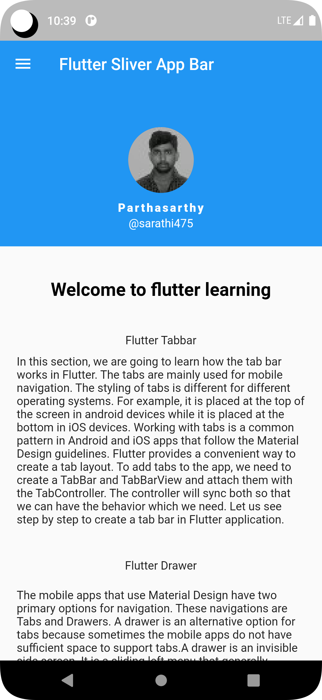

# FlutterSliverAppBar
Flutter SliverAppBar example. if you want clone or fork it.

## FrameWork
1. Flutter

## Language:
1. Dart

## Tools:
1. Git
2. Android studio / Vscode

## Pre-requirement:
1. Flutter 3.3.10
2. Dart 2.18.6

# Cli command
## check your flutter support info:

```
flutter doctor
```
## dependancy install / package install:
```
flutter pub get
```
## Run methods:
```
flutter run
```
### ✌&ensp;Preview

|           Image Preview            |            Gif Preview             |
|:----------------------------------:|:----------------------------------:|
|  |  |
